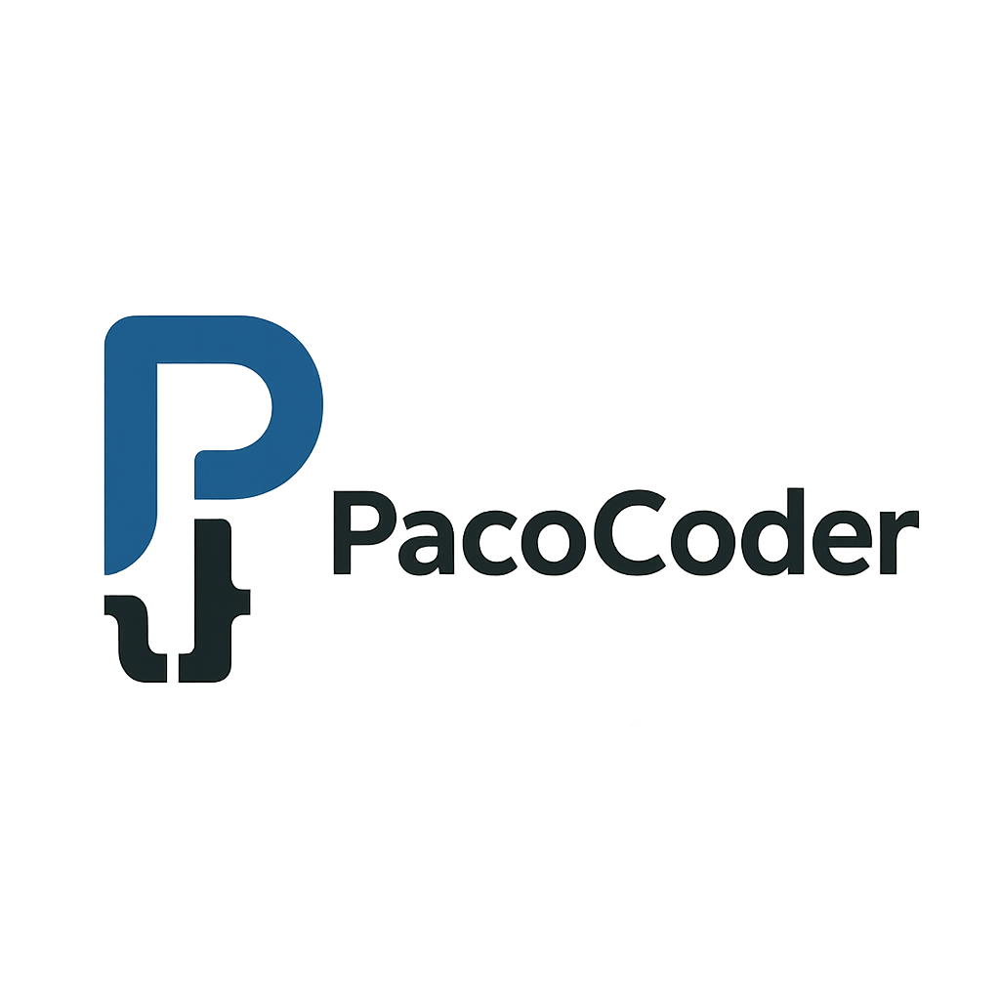

<p align="center">
  <a href="https://chatgpt.com" target="_blank">
    
  </a>
</p>

[circleci-image]: https://img.shields.io/circleci/build/github/nestjs/nest/master?token=abc123def456
[circleci-url]: https://circleci.com/gh/nestjs/nest

  <p align="center">Creacion  <a href="http://nodejs.org" target="_blank">Microservicio </a> Con el frameword Nestjs utilizado microservicios.</p>
    <p align="center">
<a href="https://nodejs.org" target="_blank">
  
</a>
<a href="https://www.npmjs.com" target="_blank">
  
</a>
<a href="https://www.npmjs.com/~nestjscore" target="_blank"></a>
<a href="https://www.prisma.io" target="_blank">
  
</a>
<a href="https://www.sqlite.org" target="_blank">
  
</a>
</p>
  <!--[](https://opencollective.com/nest#backer)
  [](https://opencollective.com/nest#sponsor)-->

# Products Microservice

## Dev

1. Clonar el repositorio.

2. Instalar dependencias 

```bash
npm install
```

3. Crear un archivo ```.env``` con las variables de entorno, con las siguiente variable son obligatorias:
  - PORT
  - DATABASE_URL

4. Ejecutar migración de prisma:

```bash
npx prisma migrate dev
```

5. Ejecutar:

```bash
npm run dev
```

